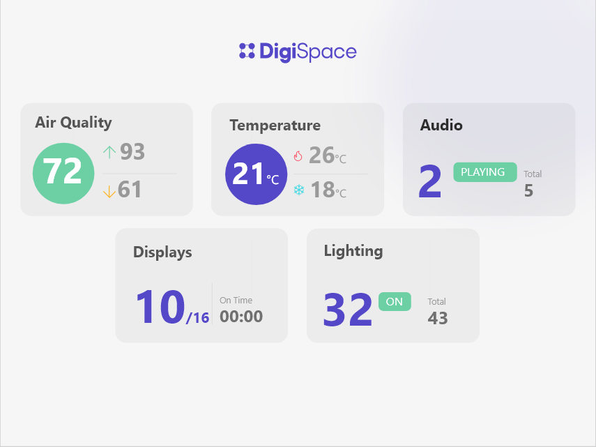

# Frontend-Developer-Task

## Files Included

```

├── README.md
├── ui_design_resources
│   ├── color_codes.txt
│   ├── design.png
│   ├── fire.svg
│   ├── logo.svg
│   ├── snowflake.svg
│   └── Rota_fonts.zip
```

## Output



## Tech Stack

**Angular**

## Instructions

- All cards (Airquality, Audio etc.,) shown on the design are **Individual Components**.
- The page is **Not responsive**, so fix any suitable resolutions and work on it. (Mention the resolution you used in the readme file)
- We are looking the output to be **Pixel perfect** and as close to the design as possible.
- Use the provided fonts (**Rota/Inter**) and take extra care with font weight choices.
- Use the provided icons. Use **font-awesome** or **feather icons** if the necessary icons not found in the folder and choose icons that closest match the design.
- It is important you **Study the design carefully** and try to get as close to visual parity as possible, including padding, margins, alignment, font sizes and weights, etc. Where you cannot achieve visual parity please be prepared to identify and explain where and why it cannot be achieved.
- After completion of the task please upload the file to Github/Gitlab with a Readme file and share the Link along with a link to your **Linkedin Profile** to [jobs@avmsolutionsuk.com]

## Extra Credit

- Add tests
- Adoptive design - Design should change according to the number of cards (components) within the page at the time. (Example if we remove airquality and audio you will have only 3 component so the design should change accordingly )
- Host the application in any platform and share us the link.
